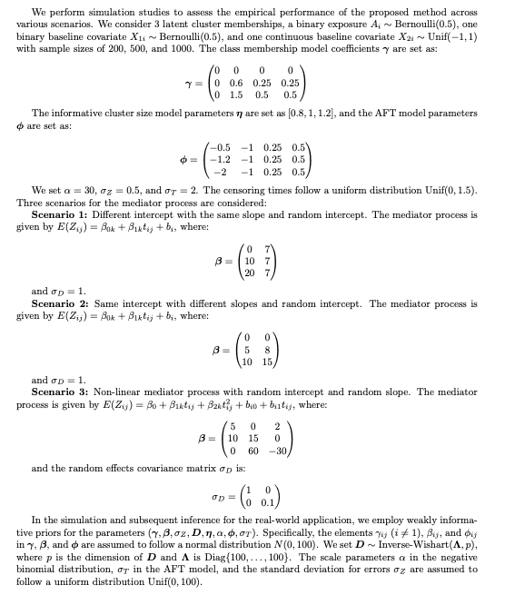
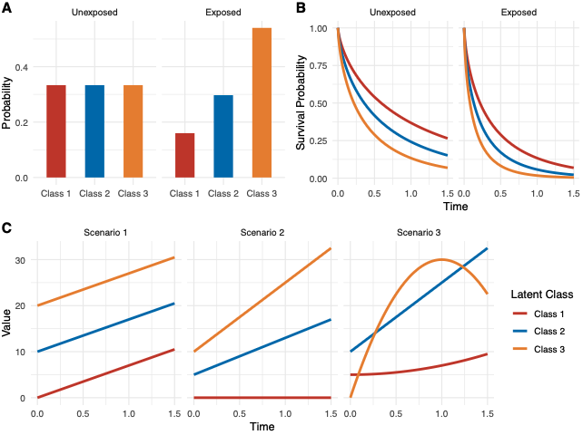
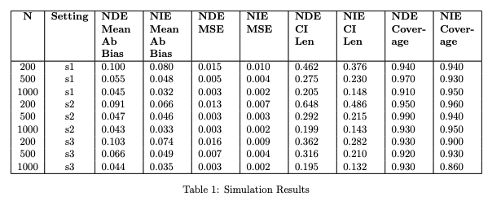

# Simulation Setting

# Simulation Result

# Reference
[1] Zheng W, van der Laan M. Longitudinal mediation analysis with time-varying mediators and exposures, with application
to survival outcomes. Journal of causal inference 2017;5(2):20160006.

[2] Lin SH, Young JG, Logan R, VanderWeele TJ. Mediation analysis for a survival outcome with time-varying exposures,
mediators, and confounders. Statistics in medicine 2017;36(26):4153–4166.

[3] Didelez V. Defining causal mediation with a longitudinal mediator and a survival outcome. Lifetime data analysis
2019;25:593–610

[4] Zeng S, Rosenbaum S, Alberts SC, Archie EA, Li F. Causal mediation analysis for sparse and irregular longitudinal data.
The Annals of Applied Statistics 2021;15(2):747–767.

[5] Zeng S, Lange EC, Archie EA, Campos FA, Alberts SC, Li F. A causal mediation model for longitudinal mediators and
survival outcomes with an application to animal behavior. Journal of Agricultural, Biological and Environmental Statistics
2023;28(2):197–218.

[6] Zhou X, Song X. Causal Mediation Analysis for Multivariate Longitudinal Data and Survival Outcomes. Structural Equa-
tion Modeling: A Multidisciplinary Journal 2023;30(5):749–760

[7] Liu X, Wang L. Causal Mediation Analysis with the Parallel Process Latent Growth Curve Mediation Model. Structural
Equation Modeling: A Multidisciplinary Journal 2024;p. 1–22.

[8] VanderWeele TJ, Chiba Y. Sensitivity analysis for direct and indirect effects in the presence of exposure-induced
mediator-outcome confounders. Epidemiology, biostatistics, and public health 2014;11(2).
